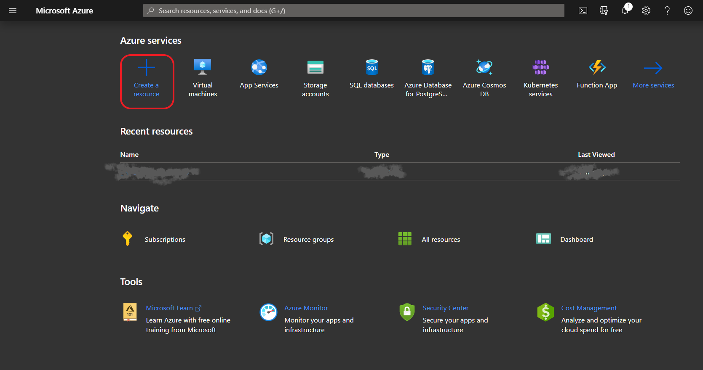
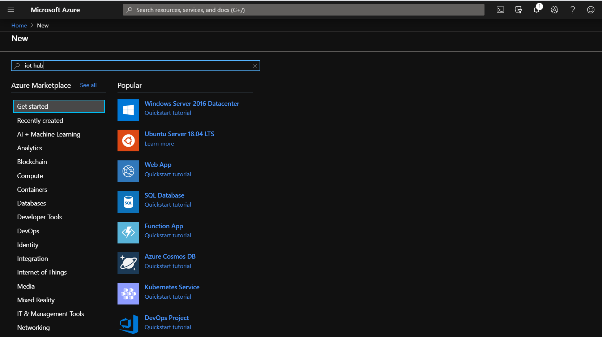
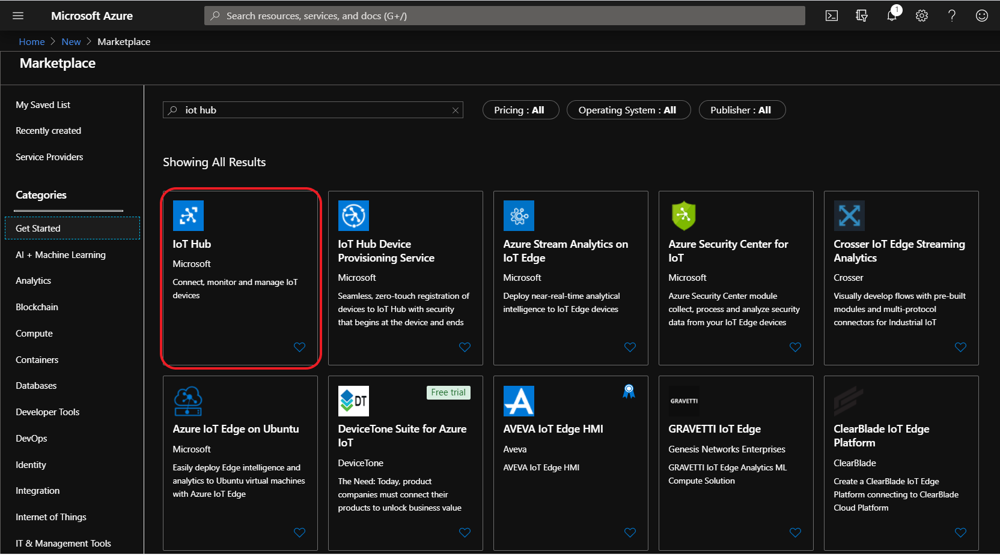
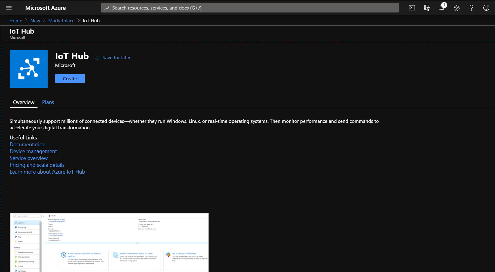
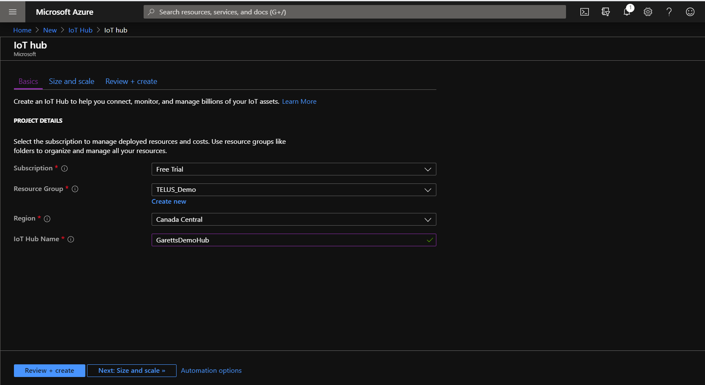
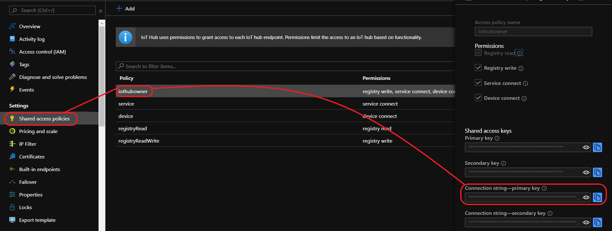
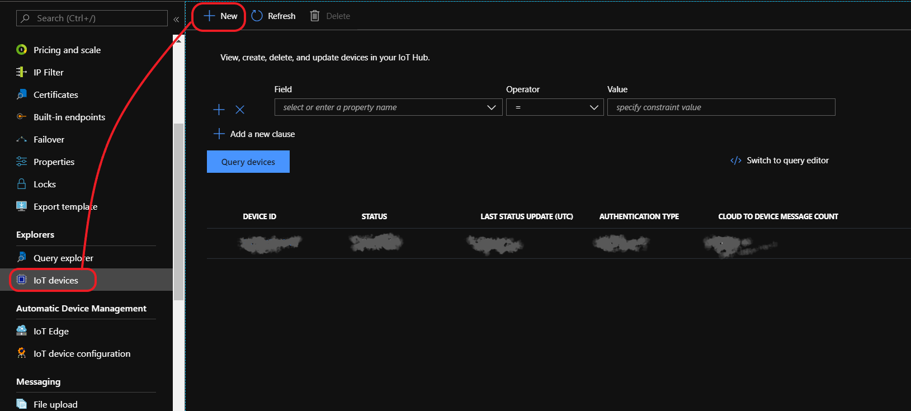
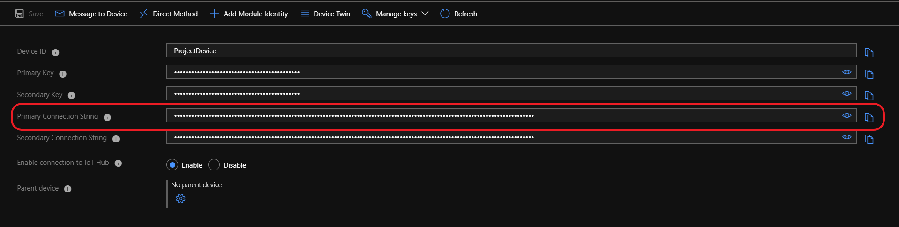
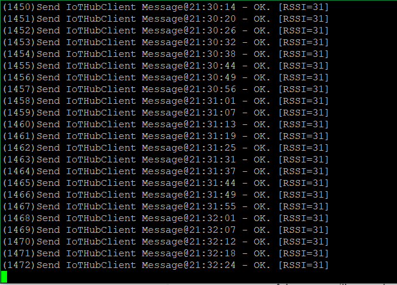

# The TELUS LTE-M IoT Starter Kit

This tutorial will help users get started with the TELUS LTE-M IoT Starter Kit, giving some background on the kit and walking users through the entire process of getting the Kit configured to send data to Microsoft Azure instance.

## Background

### The Kit

The Kit Consists of 3 Parts:
1. BG96 shield Cat.M1/NB1 & EGPRS module with added support for GPS
A 2FF SIM connector accommodates the TELUS Starter SIM that is included in the kit for connecting to the internet via TELUS’ virtual dedicated IoT network
2. X-NUCLEO-IKS01A2 sensor board for the STM32
It is equipped with Arduino UNO R3 connector layout and is designed around the LSM6DSL 3D accelerometer and 3D gyroscope, the LSM303AGR 3D accelerometer and 3D magnetometer, the HTS221 humidity and temperature sensor and the LPS22HB pressure sensor
3. NUCLEO L496ZG-P MCU
The NUCLEO-L496ZG micro-controller board is fitted with an STM32L496ZG micro-controller, clocked at 80 MHz, with 1MB Flash memory, 320 KB RAM (for development flexibility), up to 115 GPIOs, an on-board ST-LINK/V2-1 debugger/programmer, and multiple expansion interfaces (USB OTG host interface, Arduino<sup>TM</sup> Uno V3 compatible expansion headers and ST Morpho headers), and is supported by comprehensive STM32 free software libraries and examples.


### MBed OS
ARM Mbed OS is a free, open-source embedded operating system designed specifically for the "things" in the Internet of Things.

It includes all the features needed to develop a connected product based on an ARM Cortex-M microcontroller, including security, connectivity, an RTOS, and drivers for sensors and I/O devices.

### Configuring IoT Hardware

The BG96 and X-NUCLEO-IKS01A2 are already connected to each other in the box.  Ensure that the switch is in the SIM position. Some important parts of the board are below:

Ensure the SIM switch is in the `SIM` position, and the SIM is inserted with the notch close to the switch.


*[Image used from element14 Blog](https://www.element14.com/community/groups/mbed/blog/2018/09/21/implementing-an-azure-iot-client-using-the-mbed-os-part-2)*

Also, please ensure that the Rx/Tx slide switches are set as shown (maroon switches away from the BG96 chip:


*[Image used from element14 Blog](https://www.element14.com/community/groups/mbed/blog/2018/09/21/implementing-an-azure-iot-client-using-the-mbed-os-part-2)*

Connect the BG96 with sensor module to the L496 MCU so it looks like below:


*[Image used from element14 Blog](https://www.element14.com/community/groups/mbed/blog/2018/09/21/implementing-an-azure-iot-client-using-the-mbed-os-part-2)*


Now your hardware is ready to be connected and programmed.


## Getting Software and Services Configured

### Pre-Requisites (Download and Extract/Install)
There are several tools we’ll need to use throughout this tutorial, so let’s start by installing everything we can at this point:
1. [Git](https://git-scm.com/book/en/v2/Getting-Started-Installing-Git)
2. [Mercurial](https://www.mercurial-scm.org/downloads)
3. [Python 2.7](https://www.python.org/downloads/release/python-2713/) or [Python 3.8](https://www.python.org/downloads/release/python-381/)
4. [GNU ARM Embedded Toolchain](https://developer.arm.com/open-source/gnu-toolchain/gnu-rm/downloads)
5. [Azure Command-Line Tools](https://docs.microsoft.com/en-us/cli/azure/install-azure-cli?view=azure-cli-latest)

#### Note:
1. MacOS: Python 2.7 has already been built in.
2. Windows: add Python to user or systems PATH environment variable:
   * Right click on this PC in file explorer → Click Properties → Click Advanced system settings → Click Environment Variables → In System variables section, click on Path, then click Edit → Now new PATH can be added.

### Install PIP, the Python Package Installer

PIP is a command-line tool that installs Python packages, it is the standard for installing requirements for Python projects. PIP will be used to gather dependencies before MBED-OS can be compiled.
1. From the command-line run the following command to retrieve the PIP install script:
  * `curl https://bootstrap.pypa.io/get-pip.py -o get-pip.py`
1. Run the following command to retrieve and install PIP:
  * `python get-pip.py`
1. Ensure the PIP version is in 19.x.x (the installed version should be 19.2.3). Check the version by running the following command:
  * `pip --version`
1. If PIP version is not correct, run the following command to install the correct version:
  * `pip install pip==19.2.3`

Verify PIP is installed correctly and ensure Python setuptools package is up-to-date by running the following command:
* `python -m pip install --upgrade setuptools`
* If any errors occur with the above command, try appending `--user` and re-run.

### MBED Command Line (mbed-cli)
The mbed-cli is hosted on github and built in Python, and it can be downloaded using `git` and compile using `Python`.

From the command-line:
1. `git clone https://github.com/ARMmbed/mbed-cli.git`
2. `cd mbed-cli`
3. `python setup.py install`

Now the `mbed` command should be able to run from command-line, and the terminal may need to be relaunched for it to work. In Windows, `python -m` may need to be prepended.

### Download the Avnet Azure IoT Client
Avnet has created a client for the TELUS IoT starter kit that, with a couple of configuration tweaks, is ready to compile and load onto the IoT board.

Get the client downloaded by running the following from the command-line, this will create a folder with loads of files, so be sure to run the command in a preferred folder:
1. `mbed import https://github.com/Avnet/azure-iot-mbed-client`
Note: In Windows, `python -m` may need to be prepended.

The import will take a while, the client cannot do too much until Azure is up and running.

## Configuring Azure

### Setting Up Azure Account

Microsoft’s Azure is an incredibly useful cloud platform that has built-in support for IoT and allows for simple integration with several other services. To create an Azure account, please sign up [here](https://azure.microsoft.com/en-ca/) for a free trial which comes bundled with $250 of free credits.

### Creating IoT Hub

Once the account is created, please proceed to create a new IoT Hub from Azure dashboard using the “Create a resource” function:



Search for “IoT Hub”:







Give the IoT Hub a unique name, place it in the Canada East region and make sure Subscription is set to "Free Trial". The new IoT Hub should look similar to this:



Proceed to “Review and Create” then create an instance. This may take a couple of minutes.

Now the IoT Hub is created. This will be the central location for all IoT devices to connect and send whatever data which has been configured to relay, and it gives a single point to read and action on that data. Azure has security built-in, all communications between the IoT devices to Azure will be secured and visibility to that data is also protected. The next step is to retrieve keys that can be used to securely transport and monitor the data being sent between IoT devices and the newly created Azure IoT Hub.

Open the newly created IoT Hub instance, then select “Shared Access Policies” from the left-hand pane which will bring up a list of pre-created policies, select the one labeled “iothubowner”. A new right-hand pane will appear with a list of “Shared access keys”. Copy the one labeled “Connection string - primary key” and store it someplace safe for later.



The primary key just copied can be used from the Azure command-line to monitor all traffic being sent from IoT devices to the Hub. For now there’s nothing being sent to the Hub, and the key will come into play after the IoT device is configured.

### Create IoT Device

The next step is to create an IoT Device instance within IoT Hub, this will be mapped directly to the physical IoT Device. Open the IoT Hub then, from the left-pane, select “IoT Devices”, then click the “New” button to create a new device.



Give the new device a name that is relevant, this is how the source of data sent to the Hub will be identified. Leave the other settings as-is (“Symmetric Keys” selected and “Auto-generate keys” checked). Click “Save”.

Now that the IoT device is created, click it to bring up its “Device Details” screen. From this screen copy the “Connection String - primary key” and store it with the primary key which has been copied earlier from the IoT Hub creation step.



This primary key will be loaded to the IoT device to secure the communications channel between it and the IoT Hub.

At this point, everything is ready to complete the configuration of TELUS LTE-M IoT Starter Kit, so this part will be referenced soon.

### Configure IoT Device for Azure

Getting back to the “Download the Avnet Azure IoT Client” step from earlier on in the tutorial, it should have created a folder named “azure-iot-mbed-client”, within this folder there are 3 different files that are needed to configure. Open the following files in an editor of choice, the screenshots from below are from [Atom](https://atom.io/):
1. AvnetBG96_azure_client.cpp
3. mbed_settings.py

#### AvnetBG96_azure_client.cpp

This file handles the sensor information gathering from the IoT board sensors, crafting the sensor data into a message payload and communicating that payload to Azure. In this tutorial the file logic will pretty much be left as-is, but if you feel the need to modify the function of the board, it is recommended looking back to this file at a later time.

The only thing which is needed to configure in this file is the name of the IoT device (`deviceId`, line 83) and setting the connection string (`connectionString`, line 81). Set the device ID to the name used for the IoT device in Azure, and set the connection string to the “Connection String - primary key” which has been copied a couple steps ago when creating the IoT device. One thing to note, the device ID is actually part of the connection string. Below is a screenshot of my configured file:


#### mbed_settings.py

In this file, update the `GCC_ARM_PATH` value to the location where the “GNU ARM Embedded Toolchain” has been extracted. Sample change is as follows:
`/usr/local/gcc-arm-none-eabi-7-2018-q2-update/bin/` to `/Users/garett/Documents/dev/telus/iot_hack/gcc-arm-none-eabi-8-2018-q4-major/bin/`:


NOTE: Make sure to include the trailing slash, ‘/’ on a Mac, or compilation will not succeed.

### Compile

Now, everything is ready to compile the Azure client and get it loaded to the IoT device. The following steps will get the client compiled and loaded to the board:
1. Run the terminal or command-line on Mac or Windows PC respectively
1. Change to the directory to `azure-iot-mbed-client` (this is created in the same directory where `mbed import` is ran above)
1. Install the required Python packages by running the command:
  * `python -m pip install -r mbed-os/requirements.txt`
  * If errors occur, try appending `--user` to the abve command and re-run
1. Plug a USB cable from the L496 MCU (white board) using the micro-usb cable into your computer
1. Check to see if there is a USB drive detected called NODE_L496ZG.  This means the board is connected.
1. Run the command:
  * ```mbed compile -m NUCLEO_L496ZG -t GCC_ARM --profile toolchain_debug.json```
    * `python -m` may need to be prepended on Windows or use `sudo` on Mac*
1. If all goes well,  the mbed compiler will start creating a new bin file. When it is complete, the file can be found here, relative to the `azure-iot-mbed-client` directory: `BUILD/NUCLEO_L496ZG/GCC_ARM/azure-iot-mbed-client.bin`
1. Drag the created binary over to the NODE_L496ZG drive, this will load the new client software and reboot the IoT board

Once the board reboots it will immediately attempt to connect to the network, read sensor data and send that data to the IoT Hub.

Here’s an example of the payload sent:
```
{
    "event": {
        "origin": "GarettsDemoDevice",
        "payload": "{\"ObjectName\":\"Avnet NUCLEO-L496ZG+BG96 Azure IoT Client\",\"ObjectType\":\"SensorData\",\"Version\":\"1.2\",\"ReportingDevice\":\"STL496ZG-BG96\",\"Latitude\":\" 0.000\",\"Longitude\":\" 0.000\",\"GPSTime\":\"     0\",\"GPSDate\":\"\",\"Temperature\":\"23.90\",\"Humidity\":\"89\",\"Pressure\":\"1011\",\"Tilt\":\"2\",\"ButtonPress\":\"0\",\"TOD\":\"Sat 2019-02-09 16:59:52 UTC\"}"
    }
}
```

The actual data fed into the Azure function will be the JSON contents of the `payload` object.

### Monitoring Data

If all goes well, the IoT hub will start receiving the data from the board without incident. If any issues arise or you want to have a better idea of what is being sent to the Hub, it would be helpful to be able to see what exactly the board is doing and the raw data being sent.

### See Board Status

With the IoT board connected to the computer, you are able to analyze the board status using the COM port the board has connected to the computer using.

#### MacOS
1. From the terminal and issue the command ls /dev/tty.*  This will show all the serial ports in the computer.  Look for /dev/tty.usbmodemxxxxx (on my Mac it was 14203), which will be the board
2. Issue the command screen /dev/tty.usbmodemxxxxx 115200 (where xxxxx is for your particular Mac).  This connects to your device and displays the terminal output with a baud rate of 115200.

#### Windows
1. Download and install the [Quectel LTE USB Driver](files/Quectel_LTE_Windows_USB_Driver_V1.0.zip)
2. Using a client of choice (For example, [Putty](https://www.putty.org/)) open a Serial connection to the COM port the board is using (for Windows, COM port can be found using Device Manager), and a Baud Rate of 115200.

If nothing is shown in the terminal after following the above steps, press the black “RESET B2” button on the white board, this will reboot the board and should present a screen similar to this one in the terminal:


Output will continue to produce as the board makes repeated network sends to Azure, but no actual payload will be displayed. Sample outputs are as follows:



##### Tip:
If the above steps are not successful, try commenting out line 215 -- 220 and 422 -- 426 in AvnetBG96_azure_client.cpp. This will disable the GPS function and connect the board directly to LTE. After saving the file, re-compile using the command-line: `mbed compile -m NUCLEO_L496ZG -t GCC_ARM --profile toolchain_debug.json` (`python -m` may need to be prepended on Windows or use sudo on Mac). Then drag the newly generated bin file to NODE_L496ZG drive.

### Monitoring Payloads Sent to Azure

The Azure CLI tool allows users to monitor the payloads sent from the board to Azure. To see the payloads sent in real-time, please follow the following commands:
1. Issue the following command to log in to Azure from the command-line
  * `az login`
  * A browser will open, log in using your Azure credentials
1. Install the Azure IoT extension:
  * `az extension add --name azure-cli-iot-ext`
1. Retrieve the “Connection String - primary key” that has been copied earlier for IoT Hub, with it, issue the following command in the command-line terminal:
  * `az iot hub monitor-events --login "<your_connection_string"`


If all goes well, JSON payloads will start displaying as they are sent to the server:


## Done

By following the above tutorial the TELUS LTE-M IoT Starter Kit is now connected to Azure instance and sending sensor data on a regular basis.

To do something amazing with the data, it is recommended making use of one of the fantastic tutorials for how to do something with IoT data (e.g. store it in a database, trigger an action if the data meets some criteria). This one is great to get started:
https://github.com/Azure-Samples/functions-js-iot-hub-processing

Just bear in mind that the data being sent from the IoT board is in a different format than expected by the tutorial, so you will need to add your own parsing logic. The following is the updated Function code to work with the TELUS IoT board:
```
module.exports = function (context, IoTHubMessages) {
    context.log(`JavaScript eventhub trigger function called for message array: ${IoTHubMessages}`);

    var count = 0;
    var totalTemperature = 0.0;
    var totalHumidity = 0.0;
    var deviceName = "";

    IoTHubMessages.forEach(message => {
        count++;
        totalTemperature += parseFloat(message.Temperature);
        totalHumidity += parseFloat(message.Humidity);
        deviceName = message.ObjectName;
    });

    var output = {
        "deviceName": deviceName,
        "measurementsCount": count,
        "averageTemperature": totalTemperature/count,
        "averageHumidity": totalHumidity/count
    };

    context.log(`Output content: ${output}`);

    context.bindings.outputDocument = output;

    context.done();
};
```


### Acknowledgements

Big thanks to [James Flynn](https://github.com/jflynn129) of Avnet for writing the original blog series and helper tools that this README is based off and uses. Two related articles authored by James can be found [here](https://www.element14.com/community/groups/mbed/blog/2018/09/21/implementing-an-azure-iot-client-using-the-mbed-os-part-1) and [here](https://www.element14.com/community/groups/mbed/blog/2018/09/21/implementing-an-azure-iot-client-using-the-mbed-os-part-2)
